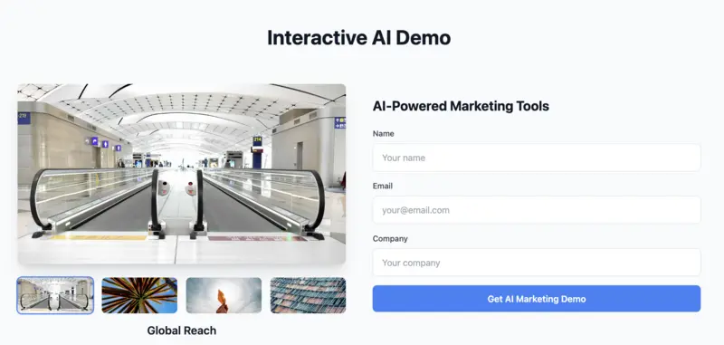
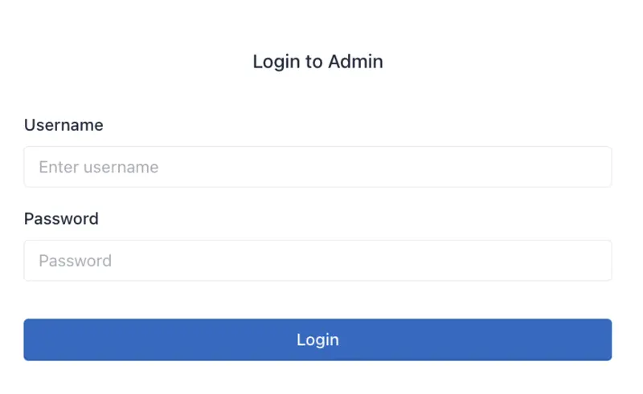

# FastOpp

FastAPI Oppkey starter package using pre-built admin
components to give FastAPI functionality comparable to Django.

The project is designed for Oppkey management (Jesse and Craig)
to assess FastAPI functionality.

The pre-built admin tools for FastAPI do not appear to be a
best practice or even popular among FastAPI developers.

After building applications with pre-built admin components, Oppkey
may eventually move from pre-built components to building
our own admin tools.

The tools could be a step in the process to evaluate FastAPI
or where Oppkey ends up.

```mermaid
flowchart TD
    A[FastOpp Assessment]
    A --> B[FastAPI+Pre-Built Admin]
    A --> C[FastAPI+Custom Admin]
    A --> D[Django with async, HTMX]
    A --> E[Django+FastAPI for LLM]
```

## Screenshots

### Interactive



### Cards with Mouseover


### Hero


### Database Admin List


### Database Entry Edit


### User Management


### User Authentication

Admin panel is restricted to logged-in users.



## Components

| Functional Concept| Component | Django Equivalent |
| -- | -- | -- |
| Production Web Server | FastAPI + uvicorn (for loads < 1,000 concurrent connections) | NGINX + Gunicorn |
| Development Web Server | uvicorn  | `manage.py runserver` in development. Django Framework |
| Development SQL Database | SQLite | SQLite |
| Production SQL Database | PostgreSQL with pgvector | PostgreSQL + pgvector, asyncpg |
| User Management | [FastAPI Users](https://github.com/fastapi-users/fastapi-users) | Django Admin |
| Database Management | [SQLAdmin](https://aminalaee.github.io/sqladmin/) + Template | Django Admin |
| Authentication | Custom JWT + Session Auth (with database user verification and FastAPI Users password hashing) | Django Admin Auth |

## Project structure

```text
├── main.py                 # FastAPI application with routes
├── auth.py                 # JWT authentication system
├── admin_auth.py           # SQLAdmin authentication backend
├── templates/              # Jinja2 templates
│   ├── index.html          # Homepage template
│   └── design-demo.html    # Static files demo template
├── static/                 # Static assets (images, CSS, JS)
│   ├── images/             # Image files
│   ├── css/                # Stylesheets
│   ├── js/                 # JavaScript files
│   └── README.md           # Static files documentation
├── db.py                   # Database configuration (uses environment variables)
├── models.py               # SQLModel models
├── users.py                # FastAPI Users configuration
├── oppman.py               # Management tool for database operations
├── scripts/                # Database setup scripts
│   ├── init_db.py          # Database initialization
│   ├── create_superuser.py # Superuser creation script
│   ├── add_test_users.py   # Test users creation script
│   ├── add_sample_products.py # Sample product data script
│   ├── check_env.py        # Environment configuration checker
│   └── migrate/            # Database migration management
├── test.db                 # SQLite database (auto-created)
├── .env                    # Environment variables (create this)
├── pyproject.toml          # Project dependencies
└── uv.lock                 # Lock file
```

## 🚀 Quick Start (For Team Members)

### Prerequisites

- Python 3.12+
  If Python 3.12+ is not on your Mac, consider [installing pyenv](https://youtu.be/1F2IK7CU76U?feature=shared)
  and install the newest 3.12.x with pyenv. Although the latest stable Python is 3.13.5, we're using 3.12.x
  right now for maximum package compatibility.
- [uv](https://docs.astral.sh/uv/) package manager

### 1. Clone and Setup

```bash
# Clone the repository
git clone <repository-url>
cd fastopp

# Install dependencies
uv sync

# Add environment variable support
uv add python-dotenv
```

### 2. Environment Configuration

Create a `.env` file in your project root:

```bash
# Create environment file with secure defaults
cat > .env << EOF
DATABASE_URL=sqlite+aiosqlite:///./test.db
SECRET_KEY=dev_secret_key_$(openssl rand -hex 32)
ENVIRONMENT=development
EOF
```

**Or manually create `.env`:**

```bash
# .env
DATABASE_URL=sqlite+aiosqlite:///./test.db
SECRET_KEY=dev_secret_key_change_in_production_$(openssl rand -hex 32)
ENVIRONMENT=development
```

### 3. One-Command Setup

```bash
# Complete setup with one command
uv run python oppman.py init
```

This single command will:
- Initialize migrations
- Create initial migration
- Apply migrations
- Initialize database with sample data
- Create superuser and test data

**Alternative: Step-by-Step Setup**

If you prefer to understand each step:

```bash
# Initialize migrations (first time only)
uv run python oppman.py migrate init

# Create initial migration
uv run python oppman.py migrate create "Initial migration"

# Apply migrations
uv run python oppman.py migrate upgrade

# Initialize database with sample data
uv run python oppman.py init
```

### 4. Start Development Server

```bash
# Start the server
uv run python oppman.py runserver
```

### 5. Access the Application

Visit these URLs in your browser:

- **Homepage**: `http://localhost:8000/`
- **Admin Panel**: `http://localhost:8000/admin/`
- **API Docs**: `http://localhost:8000/docs`

#### Admin Panel Login

Use these credentials to access the admin panel:

- **Email**: `admin@example.com`
- **Password**: `admin123`

## 🛠️ Management Commands

### Database Operations

```bash
# Initialize everything (database + superuser + users + products)
uv run python oppman.py init

# Individual operations
uv run python oppman.py db              # Initialize database only
uv run python oppman.py superuser       # Create superuser only
uv run python oppman.py users           # Add test users only
uv run python oppman.py products        # Add sample products only

# Database management
uv run python oppman.py backup          # Backup database
uv run python oppman.py delete          # Delete database (with backup)
```

### Server Management

```bash
# Development server
uv run python oppman.py runserver       # Start development server
uv run python oppman.py stopserver      # Stop development server

# Production server (optional)
uv run python oppman.py production      # Start production server
```

### Migration Management

```bash
# Initialize migrations (first time only)
uv run python oppman.py migrate init

# Create new migration
uv run python oppman.py migrate create "Add new table"

# Apply migrations
uv run python oppman.py migrate upgrade

# Check migration status
uv run python oppman.py migrate current

# View migration history
uv run python oppman.py migrate history
```

### Environment Management

```bash
# Check environment configuration
uv run python oppman.py env

# Show all available commands
uv run python oppman.py help
```

## 📊 Test Data

The application comes with pre-loaded test data:

### Users

- **Superuser**: `admin@example.com` / `admin123`
- **Test Users**: `john@example.com`, `jane@example.com`, `bob@example.com` / `test123`

### Products

Sample products with various categories and prices for testing the admin interface.

## 🔄 Database Migrations

The project uses Alembic for database migrations, providing Django-like migration functionality:

### Migration Workflow

1. **Add/Modify Models**: Edit `models.py` with your changes
2. **Create Migration**: `uv run python oppman.py migrate create "Description"`
3. **Review Migration**: Check the generated file in `alembic/versions/`
4. **Apply Migration**: `uv run python oppman.py migrate upgrade`
5. **Verify**: `uv run python oppman.py migrate current`

## 🚨 Troubleshooting

### Common Issues

1. **"Alembic not found"**

   ```bash
   uv add alembic
   ```

2. **"Alembic not initialized"**
   ```bash
   uv run python oppman.py migrate init
   ```

3. **Environment issues**
 
     ```bash
     # Check environment configuration
     uv run python oppman.py env
     ```

4. **Database issues**
 
     ```bash
     # Backup and reset
     uv run python oppman.py backup
     uv run python oppman.py delete
     uv run python oppman.py init
     ```

5. **"Module not found" errors**

   ```bash
   # Reinstall dependencies
   uv sync
   ```

6. **Port already in use**
 
     ```bash
     # Stop any running servers
     uv run python oppman.py stopserver
     
     # Or use a different port
     uv run uvicorn main:app --reload --port 8001
     ```

### Quick Reset

If something goes wrong, you can reset everything:

```bash
# Backup current database
uv run python oppman.py backup

# Delete and reinitialize
uv run python oppman.py delete
uv run python oppman.py init

# Verify setup
uv run python oppman.py env
```

## 📚 Documentation

- [PostgreSQL Installation Guide](docs/postgresql_install.md) - Database setup for production
- [Production vs Development](docs/production_vs_development.md) - Environment differences
- [Migration Guide](docs/MIGRATION_GUIDE.md) - Database migration management
- [Authentication System](docs/authentication.md) - Authentication and authorization details

## 🎯 Evaluation Focus

This setup allows your team to quickly evaluate:

1. **FastAPI Admin Interface** - Compare with Django Admin
2. **Authentication System** - JWT + Session-based auth plus FastAPI Users' PasswordHelper
3. **Database Management** - [SQLModel](https://sqlmodel.tiangolo.com/) + [Alembic migrations](https://alembic.sqlalchemy.org/en/latest/)
4. **User Management** - [FastAPI Users](https://fastapi-users.github.io/fastapi-users/latest/)
5. **Development Experience** - Environment variables, management commands
6. **Production Readiness** - PostgreSQL, Gunicorn, environment config

The goal is to assess whether FastAPI + pre-built admin tools can provide a Django-like development experience for your developer team.

### Do

| Usable Functionality | Use Admin Panel | Minimum Functionality |
| -- | -- | -- |
| Create, Update, Delete, Users | Yes | Verify only admin can delete users |
| Create new database model for different data |  No | On your own project, create new model in Python code. migrate. access data in new page and admin panel |
| Create new basic tailwind, HTMX, Alpine page | No | On your own project, add new page to `templates`. Connect to site. Must look good |
| Add new record to existing model | Yes | Delete, new, edit  |

#### Don't

| Functionality Not Covered | Plan For Next Project | Technology Plan|
| -- | -- | -- |
| real-time status updates in colored bubbles | Yes |  SSE |
| streaming data from LLM | Yes | LLM stream |
| chat box | Yes | LLM |
| assign long-running task and do something else | Yes | Simulated delay with sleep |
| React or Flutter with API endpoint | No | Refactor logic code to support both API and template access |
