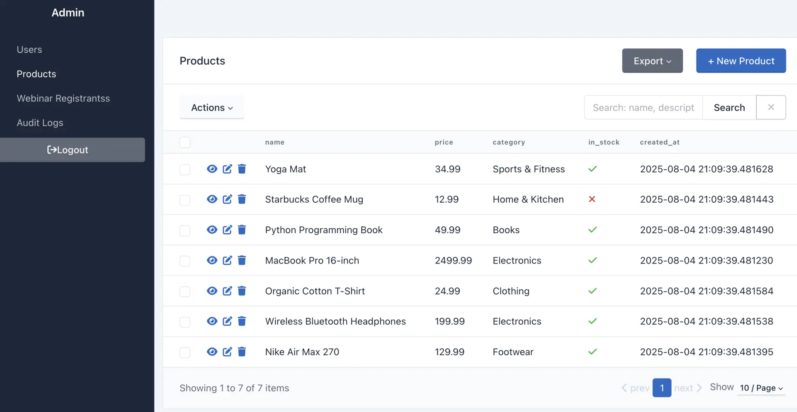
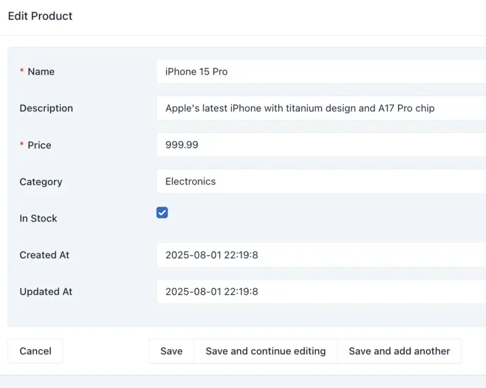
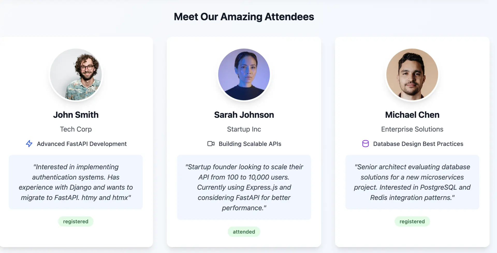
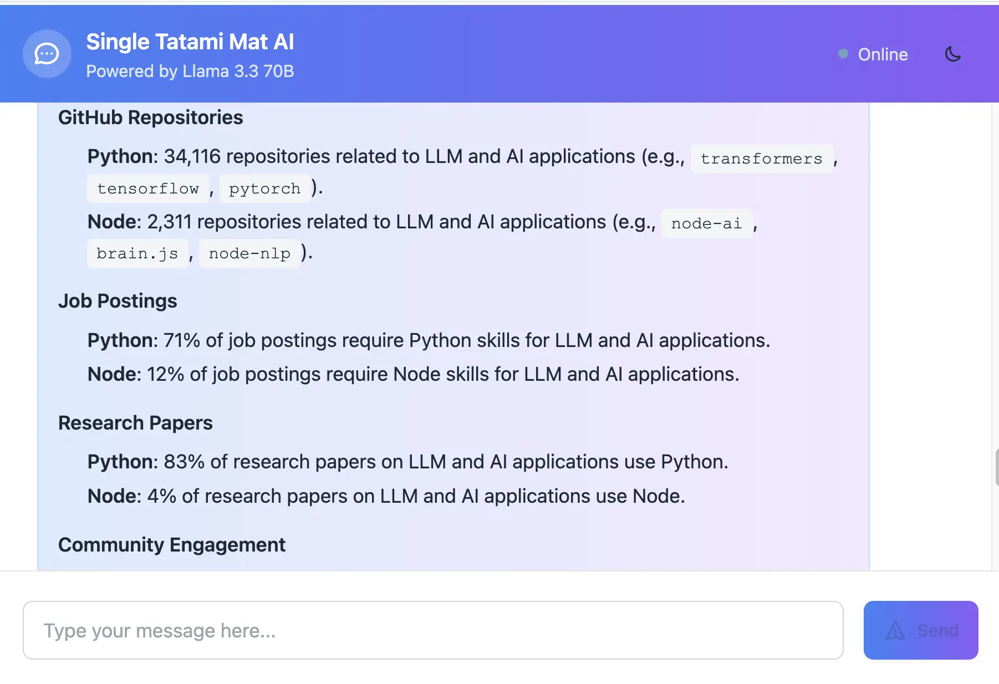
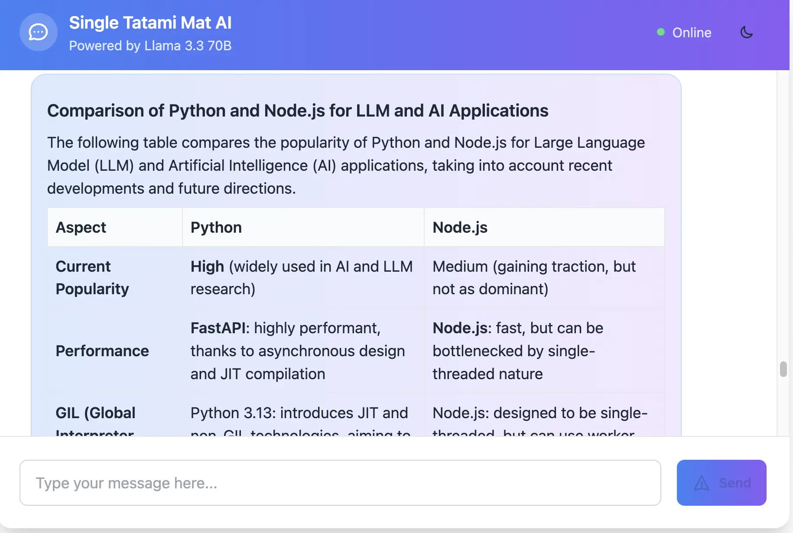

# FastOpp for AI Web Apps

FastAPI starter package for AI web applications. It uses pre-built admin
components to give FastAPI functionality comparable to Django
for AI-first applications.

Django and Flask are not designed for optimized async LLM applications.
Although both Django and Flask can absolutely be used for these
applications and are great in many, many ways, there are often rough patches during
development of asynchronous AI applications that communicate with an backend LLM such as those
at OpenAI, Anthropic, and OpenRouter.

Although FastAPI has advantages in future-proof architecture, it can
have a steep learning curve for people, especially for developers familiar with Django.

FastOpp provides an opinionated framework for FastAPI with the following features:

* admin panel similar to Django with role-based authentication
* SQL database with Django-inspired models and migrations
* Django-style HTML templates with modern UI components
  * Replaceable style templates to get started
* API endpoints to connect to other frontend frameworks
  * auto-generated documentation for API endpoints
  * designed to connect to Flutter and React in the future, but we do not have examples
* **oppman.py** management tool with some functionality similar to Django manage

## Screenshots of Included Design Examples and Functionality Demos

### Clickable Cards with Mouseover


### Change Images Without Page Reload


### Hero


### Database Admin List



### Database Entry Edit



### User Management


### User Authentication

Admin panel is restricted to logged-in users.


### Statistics Hero Card


### People Hero Card



### AI Chat with Cloud-Based LLM





## Basic Design System and Reference Template

FastOpp comes with a basic UI design system to accelerate AI application development.

## 🚀 Quick Start (For Team Members)

### Prerequisites

- Python 3.12+
  If Python 3.12+ is not on your Mac, consider [installing pyenv](https://youtu.be/1F2IK7CU76U?feature=shared)
  and install the newest 3.12.x with pyenv. Although the latest stable Python is 3.13.5, we're using 3.12.x
  right now for maximum package compatibility.
- [uv](https://docs.astral.sh/uv/) package manager

### 1. Clone and Setup

```bash
# Clone the repository
git clone <repository-url>
cd fastopp

# Install dependencies
uv sync

# Add environment variable support
uv add python-dotenv
```

### 2. Environment Configuration

Create a `.env` file in your project root:

**Required Environment Variables:**

- `DATABASE_URL`: Database connection string
- `SECRET_KEY`: Secret key for JWT tokens and session management
- `ENVIRONMENT`: Set to "development" for development mode
- `OPENROUTER_API_KEY`: API key for OpenRouter (required for AI demo features)

```bash
# Create environment file with secure defaults
cat > .env << EOF
DATABASE_URL=sqlite+aiosqlite:///./test.db
SECRET_KEY=dev_secret_key_$(openssl rand -hex 32)
ENVIRONMENT=development
OPENROUTER_API_KEY=your_openrouter_api_key_here
EOF
```

**Or manually create `.env`:**

```bash
# .env
DATABASE_URL=sqlite+aiosqlite:///./test.db
SECRET_KEY=dev_secret_key_change_in_production_$(openssl rand -hex 32)
ENVIRONMENT=development
OPENROUTER_API_KEY=your_openrouter_api_key_here
```

### 3. One-Command Setup

```bash
# Complete setup with one command
uv run python oppman.py init
```

This single command will:

- Initialize migrations
- Create initial migration
- Apply migrations
- Initialize database with sample data
- Create superuser and test data

**Alternative: Step-by-Step Setup**

If you prefer to understand each step:

```bash
# Initialize migrations (first time only)
uv run python oppman.py migrate init

# Create initial migration
uv run python oppman.py migrate create "Initial migration"

# Apply migrations
uv run python oppman.py migrate upgrade

# Initialize database with sample data
uv run python oppman.py init
```

### 4. Start Development Server

```bash
# Start the server
uv run python oppman.py runserver
```

### 5. Access the Application

Visit these URLs in your browser:

- **Homepage**: `http://localhost:8000/`
- **Admin Panel**: `http://localhost:8000/admin/`
- **API Docs**: `http://localhost:8000/docs`

#### Admin Panel Login

Use these credentials to access the admin panel:

- **Email**: `admin@example.com`
- **Password**: `admin123`

## 🛠️ Management Commands

### Database Operations

```bash
# Initialize everything (database + superuser + users + products)
uv run python oppman.py init

# Individual operations
uv run python oppman.py db              # Initialize database only
uv run python oppman.py superuser       # Create superuser only
uv run python oppman.py users           # Add test users only
uv run python oppman.py products        # Add sample products only

# Database management
uv run python oppman.py backup          # Backup database
uv run python oppman.py delete          # Delete database (with backup)
```

### Server Management

```bash
# Development server
uv run python oppman.py runserver       # Start development server
uv run python oppman.py stopserver      # Stop development server

# Production server (optional)
uv run python oppman.py production      # Start production server
```

### Migration Management

```bash
# Initialize migrations (first time only)
uv run python oppman.py migrate init

# Create new migration
uv run python oppman.py migrate create "Add new table"

# Apply migrations
uv run python oppman.py migrate upgrade

# Check migration status
uv run python oppman.py migrate current

# View migration history
uv run python oppman.py migrate history
```

### Environment Management

```bash
# Check environment configuration
uv run python oppman.py env

# Show all available commands
uv run python oppman.py help
```

## 📊 Test Data

The application comes with pre-loaded test data:

### Users

- **Superuser**: `admin@example.com` / `admin123`
- **Test Users**: `john@example.com`, `jane@example.com`, `bob@example.com` / `test123`

### Products

Sample products with various categories and prices for testing the admin interface.

## 🔄 Database Migrations

The project uses Alembic for database migrations, providing Django-like migration functionality:

### Migration Workflow

1. **Add/Modify Models**: Edit `models.py` with your changes
2. **Create Migration**: `uv run python oppman.py migrate create "Description"`
3. **Review Migration**: Check the generated file in `alembic/versions/`
4. **Apply Migration**: `uv run python oppman.py migrate upgrade`
5. **Verify**: `uv run python oppman.py migrate current`

## 🚨 Troubleshooting

### Common Issues

1. **"Alembic not found"**

   ```bash
   uv add alembic
   ```

2. **"Alembic not initialized"**

   ```bash
   uv run python oppman.py migrate init
   ```

3. **Environment issues**
 
     ```bash
     # Check environment configuration
     uv run python oppman.py env
     ```

4. **Database issues**
 
     ```bash
     # Backup and reset
     uv run python oppman.py backup
     uv run python oppman.py delete
     uv run python oppman.py init
     ```

5. **"Module not found" errors**

   ```bash
   # Reinstall dependencies
   uv sync
   ```

6. **Port already in use**
 
     ```bash
     # Stop any running servers
     uv run python oppman.py stopserver
     
     # Or use a different port
     uv run uvicorn main:app --reload --port 8001
     ```

### Quick Reset

If something goes wrong, you can reset everything:

```bash
# Backup current database
uv run python oppman.py backup

# Delete and reinitialize
uv run python oppman.py delete
uv run python oppman.py init

# Verify setup
uv run python oppman.py env
```

## 📚 Documentation

* [Architecture Overview](docs/ARCHITECTURE.md) - MVS Architecture and code organization
* [PostgreSQL Installation Guide](docs/postgresql_install.md) - Database setup for production
* [Production vs Development](docs/production_vs_development.md) - Environment differences
* [Migration Guide](docs/MIGRATION_GUIDE.md) - Database migration management
* [Authentication System](docs/authentication.md) - Authentication and authorization details

## Contributing To This Project

* [Contribute to Demos](demo_assets/README.md)

## Development Plans

* [Oppkey Development Plans](docs/plan/oppkey_development_plans.md) - includes assessment plans
* [Call for Volunteers](docs/plan/call_for_volunteers.md)
